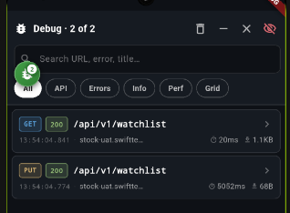

# debug_deck

Isolated, drop-in **in-app debug tools** for Flutter — fully decoupled from the
host app and switched on with a single flag.

<p align="center">
  
</p>

What you get, as a floating overlay (a draggable bug chip → full viewer):

- **API inspector** — every Dio request/response with headers, query, bodies,
  timings, status, duplicate-call detection, and per-tab search that jumps to
  the exact matching line.
- **Logs & errors console** — captured `FlutterError` / uncaught platform errors.
- **Performance monitor** — live FPS (scroll-time), UI vs raster jank split,
  stalls, worst frame, frame-time sparkline, a plain-language verdict, and the
  **current screen name** so a reading is never ambiguous.
- **Layout grid inspector** — spacing/alignment/bounds overlay.
- **App-info snapshot** — build/env/device/a11y, copyable for bug reports.

It renders **nothing** and does **no work** unless you enable it.

## Install

```yaml
# pubspec.yaml
dependencies:
  debug_deck:
    path: packages/debug_deck
```

## Integrate (4 touch-points)

### 1. Initialise once in `main()`

Gate it on your own dev/staging flag and feed it your app facts:

```dart
DebugTools.init(
  enabled: EnvironmentConfig.isDevelopment,
  appInfo: DebugAppInfo(
    version: AppConstants.versionNumber,
    environmentName: EnvironmentConfig.environmentName,
    baseUrl: ApiEndpoint.baseURL,
    isNativeCall: AppConstants.isNativeCall,
  ),
);
```

`init` also installs Flutter/platform error capture, starts the perf monitor,
and stamps app-start time — but only when `enabled` is true.

### 2. Mount the overlay

```dart
MaterialApp.router(
  builder: (context, child) =>
      DebugToolsHost(child: child ?? const SizedBox.shrink()),
  // ...
);
```

`DebugToolsHost` is a transparent pass-through when disabled — no debug
widgets, controllers or listeners exist in the tree in production.

### 3. Capture network traffic

```dart
dio.interceptors.add(DebugTools.dioInterceptor());
```

### 4. Track the current screen (optional, powers the Perf banner)

```dart
GoRouter(
  observers: [
    if (DebugTools.enabled) DebugTools.routeObserver,
  ],
  // ...
);
```

## The master switch

`DebugTools.enabled` is the single source of truth. When false, the logger,
interceptor, perf monitor, route observer and overlay all short-circuit to
no-ops. Flip it from any signal you like (build mode, env, remote flag).

## Decoupling

The package never imports the host app. The only thing it needs from the app is
the four `DebugAppInfo` values, passed in via `init`. That keeps it reusable
across projects — drop the folder in, add the path dependency, wire the four
touch-points.
