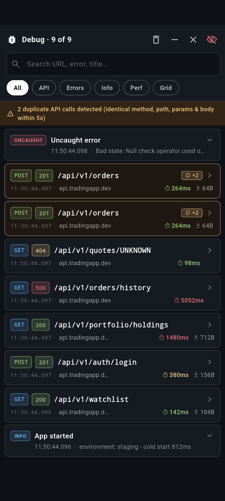
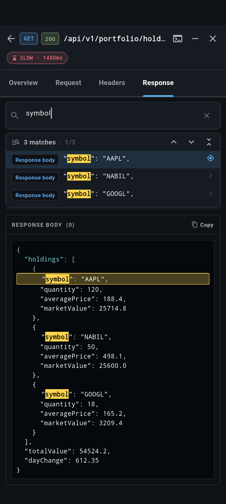
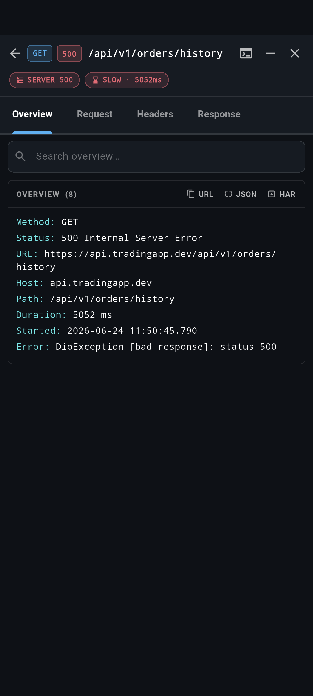
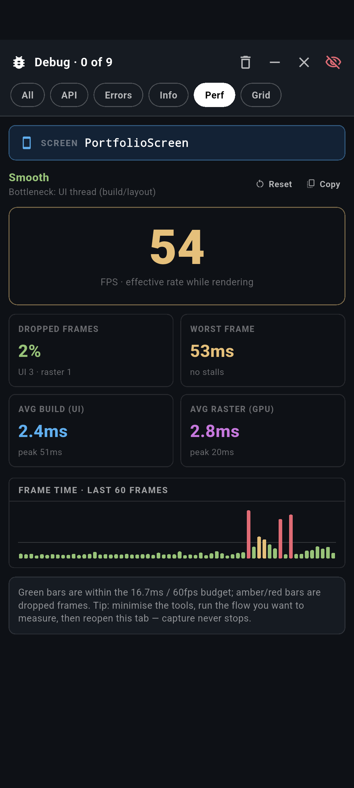
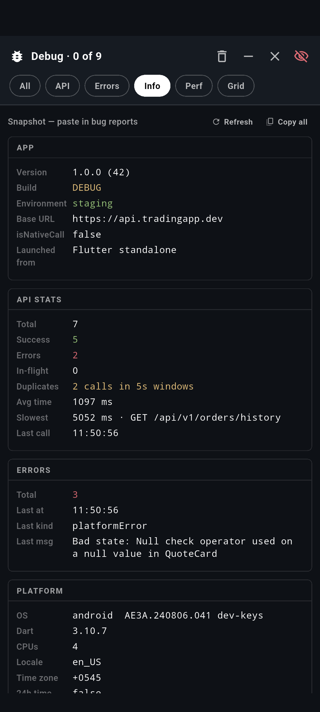

# debug_deck

Isolated, drop-in **in-app debug tools** for Flutter — fully decoupled from the
host app and switched on with a single flag.

<table>
  <tr>
    <td align="center" width="33%">
      <br>
      <sub><b>Inspector</b> · calls, errors & duplicates</sub>
    </td>
    <td align="center" width="33%">
      <br>
      <sub><b>Search a response</b> · jump to each match</sub>
    </td>
    <td align="center" width="33%">
      <br>
      <sub><b>Call detail</b> · insight chips & export</sub>
    </td>
  </tr>
  <tr>
    <td align="center" width="33%">
      <br>
      <sub><b>Performance</b> · FPS, jank & frames</sub>
    </td>
    <td align="center" width="33%">
      <br>
      <sub><b>App-info snapshot</b> · copy for reports</sub>
    </td>
    <td align="center" width="33%"></td>
  </tr>
</table>

> A runnable demo lives in [`example/`](example/) — `cd example && flutter run`.
> It wires the overlay and seeds sample traffic, so every tab has content to
> explore. The same app powers these screenshots (see
> `example/integration_test/screenshot_test.dart`).

What you get, as a floating overlay (a draggable bug chip → full viewer):

- **API inspector** — every Dio request/response with headers, query, bodies,
  timings, status, duplicate-call detection, and per-tab search that jumps to
  the exact matching line.
- **Logs & errors console** — captured `FlutterError` / uncaught platform errors.
- **Performance monitor** — live FPS (scroll-time), UI vs raster jank split,
  stalls, worst frame, frame-time sparkline, a plain-language verdict, and the
  **current screen name** so a reading is never ambiguous.
- **Layout grid inspector** — spacing/alignment/bounds overlay.
- **App-info snapshot** — build/env/device/a11y, copyable for bug reports.

It renders **nothing** and does **no work** unless you enable it.

## Why debug_deck

A few things it does that most in-app inspectors don't:

### 🔎 Search *inside* every request and response — and jump to the hit

The standout feature. Open any API call and each tab (Overview · Request ·
Headers · Response) carries **its own field-and-body search**. As you type:

- every match is **highlighted in place** across key/value rows *and* inside the
  pretty-printed, syntax-highlighted JSON body;
- a **results bar** lists each hit with the section it lives in (e.g.
  `Response body`) and a snippet;
- **prev / next chevrons** (or tapping a result) **scroll straight to that exact
  field or line** and ring it — so finding one token in a 2,000-line payload is
  one tap, not a manual scroll.

No more copying a body into another editor just to `Ctrl-F` it.

### 🧠 Insight at a glance

Open a call and auto-derived **insight chips** call out what matters —
`SLOW · 1480ms`, `SERVER 500`, `NOT MODIFIED · CACHED`, `LARGE · 1.2MB`,
`UNAUTHORIZED` — so you read the verdict before the numbers. In the list,
**latency is colour-banded** (green → amber → red) and oversized payloads are
flagged, so the problem call is obvious without opening anything.

### 🪪 Duplicate-call detection

The inspector flags requests that fire **identical method + path + params + body
within 5 s** of each other (a classic double-tap / rebuild bug), badges each row
with the cluster size, and shows a warning bar with the count.

### 📤 One-tap export

Copy any call as **cURL**, a flat **JSON** dump, or a **HAR 1.2** archive you can
drop into browser devtools or any HAR viewer — ready to paste into a bug report.

### 🧭 Keeps your place

Minimise to the app and the viewer is preserved exactly — filter tab, search
text, the open API detail, its tab, and every scroll offset all survive the
round-trip. **Close** resets to the start; **minimise** picks up where you left
off.

### ⚡ Zero cost when off

`DebugTools.enabled == false` short-circuits the logger, interceptor, perf
monitor, route observer and overlay to no-ops, and `DebugToolsHost` becomes a
transparent pass-through — no debug widgets or listeners exist in the tree in
production.

## Install

```yaml
# pubspec.yaml
dependencies:
  debug_deck:
    path: packages/debug_deck
```

## Integrate (4 touch-points)

### 1. Initialise once in `main()`

Gate it on your own dev/staging flag and feed it your app facts:

```dart
DebugTools.init(
  enabled: EnvironmentConfig.isDevelopment,
  appInfo: DebugAppInfo(
    version: AppConstants.versionNumber,
    environmentName: EnvironmentConfig.environmentName,
    baseUrl: ApiEndpoint.baseURL,
    isNativeCall: AppConstants.isNativeCall,
  ),
);
```

`init` also installs Flutter/platform error capture, starts the perf monitor,
and stamps app-start time — but only when `enabled` is true.

### 2. Mount the overlay

```dart
MaterialApp.router(
  builder: (context, child) =>
      DebugToolsHost(child: child ?? const SizedBox.shrink()),
  // ...
);
```

`DebugToolsHost` is a transparent pass-through when disabled — no debug
widgets, controllers or listeners exist in the tree in production.

### 3. Capture network traffic

```dart
dio.interceptors.add(DebugTools.dioInterceptor());
```

### 4. Track the current screen (optional, powers the Perf banner)

```dart
GoRouter(
  observers: [
    if (DebugTools.enabled) DebugTools.routeObserver,
  ],
  // ...
);
```

## The master switch

`DebugTools.enabled` is the single source of truth. When false, the logger,
interceptor, perf monitor, route observer and overlay all short-circuit to
no-ops. Flip it from any signal you like (build mode, env, remote flag).

## Decoupling

The package never imports the host app. The only thing it needs from the app is
the four `DebugAppInfo` values, passed in via `init`. That keeps it reusable
across projects — drop the folder in, add the path dependency, wire the four
touch-points.
